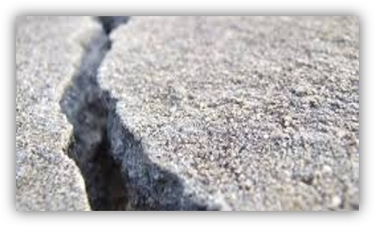
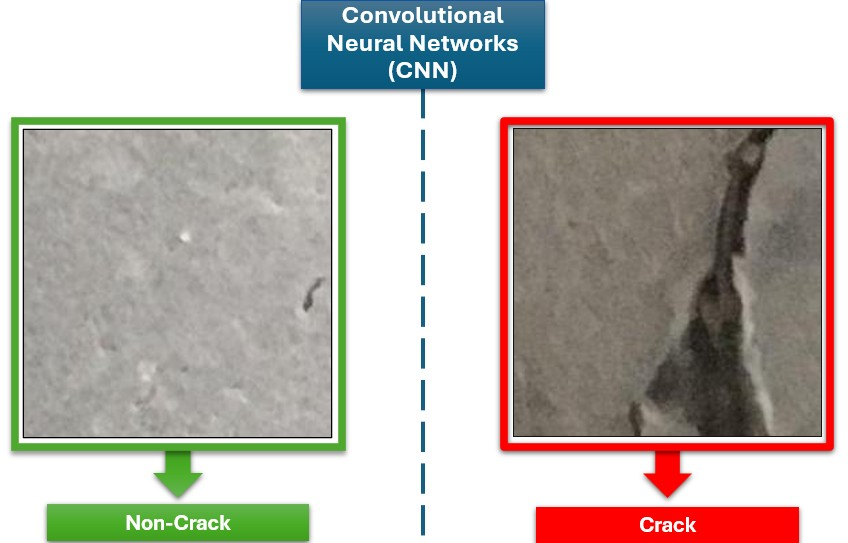
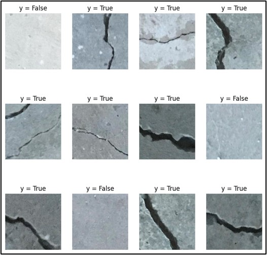
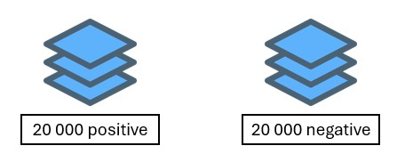
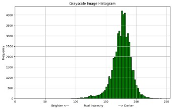
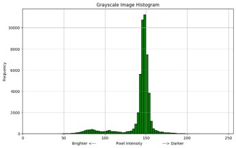
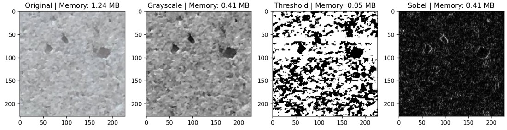
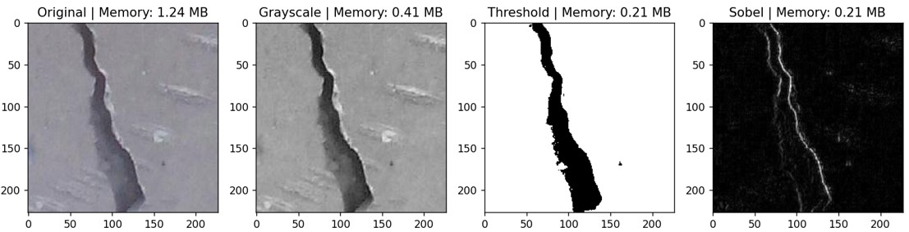

# 📌 Concrete Crack Detection using Convolutional Neural Networks

<p align="center">
  
</p>

## 📖 Description
This project is a machine learning model designed to train a convolutional neural network to classify concrete images, wether a crack is present or not. The model is trained on the Mendeley Data [2] dataset to achieve high accuracy in distinguishing between fractured and non-fractured concrete stuctures.

<p align="center">
  
</p>

## 📁 Project Structure

```txt
/concrete-crack-detection
│── README.md               # Project overview and instructions
│── requirements.txt        # Dependencies
│── notebooks/              # Jupyter notebooks for EDA and model training
│── src/                    # Source code
│   ├── data/               # Data processing scripts
│   ├── models/             # Model definition, training, and evaluation
│   ├── utils/              # Helper functions
│── data/                   # Raw and processed datasets (ignored in Git)
│   ├── raw/                # Data processing scripts (ignored in Git)
│   ├── processed/          # Feature X and target y
│── models/                 # Saved model files
```

## 🚀 Installation

1. Clone the repository:
```bash
git clone https://github.com/Younes-Toumi/concrete-crack-detection.git
cd concrete-crack-detection
```

2. Create a virtual environment:
```bash
python -m venv venv
source venv/bin/activate  # For Mac/Linux
venv\Scripts\activate  # For Windows
```

3. Install dependencies:

```bash
pip install -r requirements.txt
```

## 🖥 Usage

This repository comes already with the loaded that
1. Download the dataset:
To donwload the data, it is provided by [1] (refference): https://data.mendeley.com/datasets/5y9wdsg2zt/2

  - Run the file located in `src\data\data_loader.py` and specify the amount of images to be donwloaded for each class. With:

  ```bash
  python -m src\data\data_loader.py
  ```

  - Run the `processing_loader.py` to perform image processing on the original images (grayscale, filtering, sobol).


2. run the `src\main.ipynb` to train the model and then saving it.

## 📊 Results

## 📌 Dataset

<p align="center">
  
</p>


<p align="center">
  
</p>


Source: [Dataset Name & Link]

Preprocessing: [Any preprocessing applied]

<p align="center">
  
</p>

<p align="center">
  
</p>

<p align="center">
  
</p>

<p align="center">
  
</p>


## 📜 License

This project is licensed under the MIT License - see the LICENSE file for details.

## 📝 Acknowledgments

[Mention datasets, libraries, or references that inspired the project]

[1] Özgenel, Çağlar Fırat (2019), “Concrete Crack Images for Classification”, Mendeley Data, V2, doi: 10.17632/5y9wdsg2zt.2

[2] Golding, V.P., Gharineiat, Z., Munawar, H.S., Ullah, F. (2022): Crack Detection in Concrete Structures Using Deep Learning. Sustainability, 14, 8117. https://doi.org/10.3390/su14138117. 

[3] Özgenel, Ç.F., Gönenç Sorguç, A. (2018): Performance Comparison of Pretrained Convolutional Neural Networks on Crack Detection in Buildings, ISARC 2018, Berlin.

[4] Lei Z. , Fan Y. , Yimin D. Z., and Y. J. Z., Zhang, L., Yang, F., Zhang, Y. D., & Zhu, Y. J. (2016): Road Crack Detection Using Deep Convolutional Neural Network. IEEE International Conference on Image Processing (ICIP). http://doi.org/10.1109/ICIP.2016.7533052.


## Crack Detection in Concrete Structures using CNN
### by Toumi, Younes Abdeldjalil
### Machine Learning for Material and Structural Mechanics  - WS 2024/25

The following projects contains 10 files/folders:

1. Classes (folder):
    Contains the class of `Classifier` that utilises python's OOP style, and better manage the project.

2. Dataset (folder):
    Contains the .jpg images of both negative and positive images

3. Loaded Data (folder):
    Contains the dataset in terms of numpy arrays after conversion (done in `utility\save_data.py`)

4. Models (folder):
    Two python files defining the architecture of the CNN

5. Trained Models (folder):
    Since the training was ran over night when using the CPU, it was necessary to save the models, in order to generate the plots the next day (for the comparative study)

    dumped_data_X.pickle contains:
        + the history of the training of X
        + validation set of X
        + test set of X

6. utility (folder):
    This folder contains some utiliy functions for the preprocessing, and converting the images to numpy arrays.

7. virtual_env (folder):
    The virtual environment used later on to utilise the GPU (tensorflow 2.10.0)

8. the main file for training
9. the main notebook file for figure generation
10. This readme.md file

Instructions:
Since saving the numpy arrays results in a .ZIP file exceeding 100 Mb (Stud.IP limit), in order to run the code:
1. Download the dataset provided by: https://data.mendeley.com/datasets/5y9wdsg2zt/2
2. run the `utility\save_data.py` by specifiying the positive and negative folder (this will generate the numyp arrays)
3. Afterwards the `main.py` can be executed, adjusting the folder location of the different data.

Alternatively, the project is available via google drive (including the saved models, virtual environement and arrays) under:
